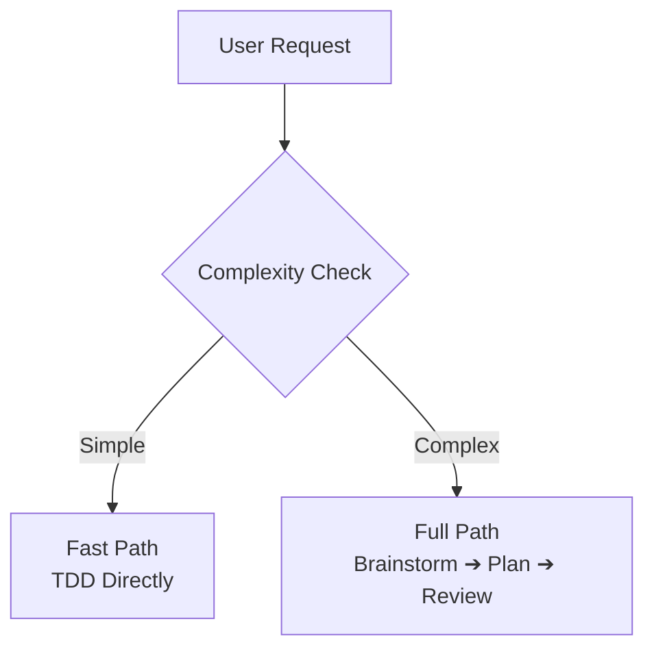

<a id="readme-top"></a>

<div align="center">

# ⚡ Superpowers Enhanced
*A high-discipline engineering pipeline and quality gate overlay for OpenCode*

[](https://nodejs.org/)
[](install.sh)
[](install.ps1)
[](LICENSE)

⭐ If you find this configuration helpful, star the repository!

[Features](#features) • [Quick Start](#quick-start) • [How it Works](#how-it-works) • [The Six Quality Gates](#the-six-quality-gates) • [Troubleshooting](#troubleshooting)

</div>

---

OpenCode agents default to an implementation-first mode: describe what you want, and they immediately begin writing code. While fast, this ad-hoc approach often leads to regressive bugs, missed security boundaries, and architectural debt.

**Superpowers Enhanced** acts as a structured quality gate overlay on top of OpenCode. It wraps your agentic environment in a strict engineering pipeline—enforcing design, security auditing, multi-perspective reviews, and automated verification.

### Value Proposition

| Task | Default OpenCode | Superpowers Enhanced |
| :--- | :--- | :--- |
| **Task Initiation** | Jump straight to implementation | **Brainstorm** intent, propose approaches, design first |
| **Security Auditing** | Manual oversight or post-factum scans | **Hard-coded triage** triggered automatically on file paths/content |
| **Architecture** | Single-minded design execution | **Deliberation Gate** with triple-role critic audit |
| **Sub-agent Dispatch** | Flat commands with no downstream context | **Social Accountability** consequence-weighted prompts |
| **Bug Isolation** | Bulk sequential patching (creates conflicts) | **ASI Loop** isolates, fixes with TDD, re-scans sequentially |
| **Integrity Assurance** | Trust based on model confidence | **SHA-256 state hashing** to prevent TOCTOU exploits |
| **Simple Work** | Heavyweight workflow overhead | **Fast Path** auto-routing (TDD directly, skip ceremony) |

---

## Features

- 🛡️ **Zero-Trust Security Triage** - Automated trigger rules check paths, contents, and directories to force audits before any code executes.
- ⚖️ **Adversarial Deliberation** - Spawns distinct virtual personas (Skeptic, Minimalist, Maintainer) to critique complex architectures.
- 🔁 **ASI Batch Patching** - Restricts bug fixing to one isolated issue at a time with dynamic re-scanning and an anti-infinite loop guard.
- 🤝 **Consequence-Weighted Prompts** - Shapes sub-agent behaviors through role-specific social accountability framing.
- 🔑 **Anti-TOCTOU Hashing** - Uses ephemeral state hashing to guarantee file integrity between check and execution on security-sensitive code.
- 🎯 **Multi-Path Self-Consistency** - Validates root cause hypotheses and completion claims through independent checks.
- ⚡ **Complexity-Aware Routing** - Leverages heuristic analysis to fast-path trivial tasks and save up to 89% in token costs.

---

## Quick Start

> [!NOTE]
> No manual dependencies or external package setups are required. The cross-platform installer handles Node.js validation, backs up your active configuration, and registers all modules automatically.

### Installation

```bash
# Linux / macOS / WSL
bash <(curl -fsSL https://raw.githubusercontent.com/S1NXIAN/superpowers-enhanced/main/install.sh)

# Windows (PowerShell)
irm https://raw.githubusercontent.com/S1NXIAN/superpowers-enhanced/main/install.ps1 | iex
```

Once installed, restart your OpenCode session and try initiating a task:
> _"Let's build a secure session manager"_

### Manual Installation

If you prefer to inspect and run the installation locally:

```bash
git clone https://github.com/S1NXIAN/superpowers-enhanced.git ~/superpowers-enhanced
cd ~/superpowers-enhanced

node setup.mjs            # Interactive setup
node setup.mjs --force    # Non-interactive, skip prompts
node setup.mjs --dry-run  # Preview config and file changes only
```

> [!IMPORTANT]
> You must completely restart the OpenCode application/daemon after installation for the changes and skills to load.

### Verification Checklist

To verify that the configuration and default agent are correctly registered:
- Verify that the agent configuration files exist in your home configuration directory:
  ```bash
  ls ~/.config/opencode/AGENTS.md
  ls ~/.config/opencode/agent/zeus.md
  ```
- Verify that the default agent is set to `zeus` in the configuration file:
  ```bash
  node -e "console.log(JSON.parse(require('fs').readFileSync(require('path').join(require('os').homedir(),'.config','opencode','opencode.json'),'utf8')).default_agent)"
  ```
  Expected Output: `zeus`

---

## How it Works

The **Zeus Orchestrator** (`agent/zeus.md`) manages the development loop. It automatically classifies incoming requests to select the most token-efficient route:



### Classification Heuristics

| Attribute | Simple (Fast Path) | Complex (Full Path) |
| :--- | :--- | :--- |
| **Files Touched** | ≤ 2 files | ≥ 3 files or new subsystem |
| **Keywords** | *fix, typo, rename, update, bump, refactor* | *implement, add, create, design, architect* |
| **Security Triggers** | No T1-T3 matches | **Any** T1-T3 match (Forces full path) |
| **Scope** | Single localized concern | New capability, integration, cross-cutting |
| **Manual Override** | Prefix request with `@quick` | Prefix request with `@full` |

### Manual Overrides

You can explicitly bypass the heuristic routing at any time:
- **`@quick`**: Forces the fast path—ideal for quick refactors, typo fixes, and styling updates.
- **`@full`**: Forces the complete, audited Superpowers pipeline—recommended when adding crucial features.

---

## The Six Quality Gates

Superpowers Enhanced integrates six key protocols directly into the agentic loop.

```text
       [Deliberation Gate] — before architecture for complex tasks
                │
                ▼
        brainstorming ──► design doc ──► user approval
                │
                ▼
        [Security Triage] — before every task, hard-coded pattern match
                │
                ▼
        writing-plans ──► implementation plan ──► user approval
                │
                ▼
        [Social Accountability] — injected in sub-agent prompts
                │
                ▼
        subagent-driven-development ──► task-by-task execution
                │
                ▼
          [ASI Loop] ──► isolate & patch one bug at a time
          [Hash Verification] ──► anti-TOCTOU payload check
          [Self-Consistency] ──► multi-path root cause audit
                │
                ▼
        finishing-a-development-branch ──► merge / PR / cleanup
```

### 🛡️ Security Triage (`skills/security-triage/`)

> [!IMPORTANT]
> The security triage gate operates on a zero-trust model. If any trigger matches, execution halts immediately and flags the task as `[SECURITY-TRIAGE]` to enforce a mandatory 4-point security audit checklist.

- **T1 Paths**: Matches file patterns like `*auth*/**`, `*login*/**`, `*session*/**`, `*secret*/**`, `*token*/**`, `*.pem`, `*.key`.
- **T2 Code**: Scans file modifications for terms such as `def authenticate*`, `SECRET_KEY`, `eval(`, `os.system`, `subprocess.*`.
- **T3 Directories**: Automatically flags files residing in `auth/`, `security/`, `crypto/`, `secrets/`, `middleware/auth*/`.

### ⚖️ Deliberation Gate (`skills/deliberation-gate/`)

Triggered automatically before architecting tier-3 tasks (4+ files, new subsystems, or cross-cutting changes). It spawns three stakeholder roles for audit:
- **Skeptic**: Focuses on why the design will fail at scale (concurrency, bottlenecks, race conditions).
- **Minimalist**: Focuses on how to achieve the goal using existing utilities without adding new dependencies or files.
- **Maintainer**: Focuses on long-term technical debt, testability, and future developer comprehension.
- **Action**: Collects exactly one un-debated critique per role and synthesizes a revised design document for user approval.

### 🤝 Social Accountability (`skills/social-accountability/`)

Injects consequence-weighted framing into sub-agent prompts. LLMs experience lower hallucination rates and allocate more cognitive resources when failure modes are defined:
- **Implementer**: Warned that code accuracy controls downstream pipeline compute; missed test cases erode trust scores.
- **Spec Reviewer**: Reminded that false positives waste engineering hours, while missed requirements cost 10x more to patch later.
- **Code Reviewer**: Reminded they are the last gate before production—technical debt from structural approvals compounds exponentially.

### 🔁 ASI Loop (`skills/asi-loop/`)

An Actionable Side Information protocol for batch bug fixes and audit findings:
- **Isolate and Fix**: Strictly isolates and resolves exactly **one** issue per cycle.
- **TDD & Verify**: Fixes the issue using TDD, then runs tests and scans *only* on the affected files.
- **Re-Scan**: Dynamically updates the issue backlog and re-checks for structural side-effects.
- **Halt Guard**: Automatically halts after 4 cycles to preserve the active diff state and present a diagnostic report to the user.

### 🔑 Ephemeral Hashing (`scripts/verify-hash.sh`)

An anti-TOCTOU (Time-of-Check to Time-of-Use) cryptographic shield:
- **Capture**: Automatically generates a SHA-256 hash of a file immediately after a sub-agent writes or modifies it.
- **Verification**: Recalculates and verifies the hash right before test execution or deployment.
- **Response**: Instantly terminates the pipeline and alerts the user if the hash has mutated, neutralizing code-swapping exploits.

### 🎯 Self-Consistency Reasoning

Forces multi-path validation during debugging and verification to prevent confident-but-wrong single-chain failures:
- **During Debugging**: Generates 3-5 independent root-cause explanations using different tracks (e.g. data flow, environment). Proceeds only if ≥60% agree.
- **During Verification**: Generates 2-3 distinct, multi-angle tests (e.g., negative boundaries, side-effect audits) before declaring a task complete.

---

## Project Structure

```text
superpowers-enhanced/
├── AGENTS.md                 # User instructions (highest priority rulebook)
├── opencode-template.json    # Base OpenCode config template
├── install.sh                # Unix installation entrypoint
├── install.ps1               # Windows PowerShell installation entrypoint
├── setup.mjs                 # Cross-platform JSON-merge configuration setup
├── uninstall.sh              # Unix uninstallation cleanup script
├── uninstall.ps1             # Windows uninstallation cleanup script
├── uninstall.mjs             # Cross-platform configuration restorer
├── agent/
│   └── zeus.md               # Zeus Orchestrator (default agent)
├── prompts/
│   ├── implementer.md        # Consequence-weighted sub-agent implementer template
│   ├── spec-reviewer.md     # Consequence-weighted sub-agent spec reviewer template
│   └── code-quality-reviewer.md # Consequence-weighted sub-agent quality reviewer template
├── scripts/
│   └── verify-hash.sh        # SHA-256 state hashing script
├── skills/
│   ├── asi-loop/             # Dynamic bug-isolation skill
│   ├── deliberation-gate/    # Personas-driven architecture critique
│   ├── security-triage/      # Zero-trust trigger logic
│   └── social-accountability/ # Consequence-weighting engine
└── tests/
    └── agent/
        └── zeus-structure.test.mjs  # Lint and structural checks for zeus.md
```

---

## Troubleshooting

### Config Schema Validation Crashes

> [!WARNING]
> OpenCode versions 1.15.10+ reject unrecognized top-level keys like `enable_experimental_skills`.

If you experience crashes immediately on startup:
1. Open your global `~/.config/opencode/opencode.json` file.
2. Remove any unrecognized fields (like `enable_experimental_skills`).
3. Verify that the `model` field is set to a valid, resolvable model ID (such as `"opencode/deepseek-v4-flash-free"` or `"google/gemini-3-flash-preview"`).

### Skills or Agents Not Loading

1. Verify that `skills.paths` in your global `opencode.json` contains the path to the skills directory (typically `"skills/superpowers-enhanced"` or absolute path to the skills folder).
2. Verify that the skill files actually exist at that location.
3. Check that the `instructions` array contains `"AGENTS.md"`.
4. Restart the OpenCode application/daemon—skills, agents, and instructions are loaded into memory *only* during boot.

### Uninstalling

To clean up all registered directories and restore your original `opencode.json` configuration from the automatic backup:

```bash
# Unix (Linux / macOS / WSL)
bash <(curl -fsSL https://raw.githubusercontent.com/S1NXIAN/superpowers-enhanced/main/uninstall.sh)

# Windows (PowerShell)
irm https://raw.githubusercontent.com/S1NXIAN/superpowers-enhanced/main/uninstall.ps1 | iex
```

Local/manual cleanup:
```bash
node uninstall.mjs
```

([back to top](#readme-top))